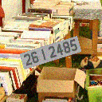

# license-plate-recognition
license plate recognition project using DNN

### Task
- To recognize the Plate Number and Character

#### (1) First Step
- generate the training image (Englis Version)
- Plate shows that string ( 99 A 1234 )
- Plate number generated on the random background images
- Thanks to Matt's blog [Link](https://matthewearl.github.io/2016/05/06/cnn-anpr/),  [Github](https://github.com/matthewearl/deep-anpr)
- I made randomly generated training image (~20,000)
- Image size 128x128
- Label-coord ( ex, 99 A 1234 ) and mask for plate ( object detection task )

##### Sample data images
plate number : [ 26 I 2485 ]

Plate object position : (24	67)	(96	44)	(30	87)	(102	64)

