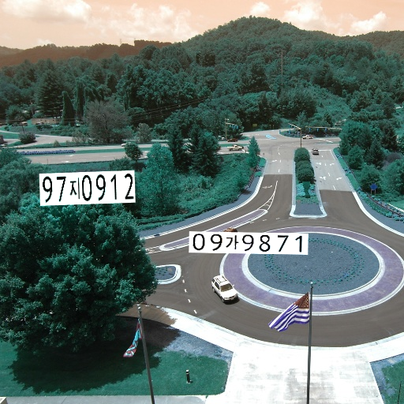

# license-plate-recognition
license plate recognition project using DNN

### Task
- To recognize the Plate Number and Character

#### (1) First Step
- Train Data generation
``` get_plate_data.ipynb ```
- generate the training image (Korean Version)
- Plate shows that string ( 99 가 1234 )
- Plate number generated on the random background images
- Thanks to Matt's blog [Link](https://matthewearl.github.io/2016/05/06/cnn-anpr/),  [Github](https://github.com/matthewearl/deep-anpr)
- I made randomly generated training image (~15,000)
- Image size 512x512
- Label-coord ( ex, 99 가 1234 ) and mask for plate ( object detection task )

#### (2) Second Step
- Training the generated data to detect 'plate'

###### Sample data images
- plate number : [ 97 지 0912 , 09 가 9871 ]


<br>


### Model Training
``` model_train.py ```

Thanks to ( https://github.com/experiencor/keras-yolo2 )


### Requirements
- Tensorflow-gpu (https://www.tensorflow.org/install/)
- Additional package

```pip install -r requirements.txt ```
